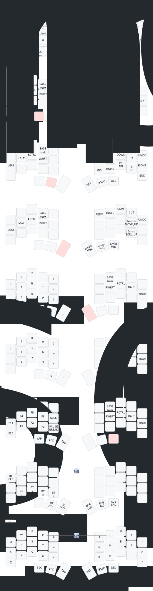

# zmk-config

Personal [ZMK](https://zmk.dev) firmware configuration for the **chocofi**, a 34-key wireless split keyboard.\
Reproducible build environment via Nix, hands-off local builds via `just`.

---

## Hardware

| Component | Choice                                                 |
| --------- | ------------------------------------------------------ |
| Keyboard  | chocofi (34 keys, split, low-profile choc v2)          |
| MCU       | [nice!nano v2](https://nicekeyboards.com/nice-nano) ×2 |
| Display   | nice_view_gem (via `nice_view_adapter`)                |
| Firmware  | ZMK with ZMK Studio enabled on the left (central) half |

---

## Layout

Colemak-DH base with Miryoku-style homerow mods and a layer-per-purpose split.
Run `just draw` to regenerate [`keymap.svg`](./keymap.svg) from the source keymap.

### Layers

| #   | Layer | Purpose                                    |
| --- | ----- | ------------------------------------------ |
| 0   | BASE  | Colemak-DH with homerow mods (GACS / SCAG) |
| 1   | MEDIA | Playback and volume                        |
| 2   | NAV   | Arrows, page control, clipboard actions    |
| 3   | MOUSE | Mouse move, scroll, click                  |
| 4   | SYM   | Symbols                                    |
| 5   | NUM   | Numbers and math operators                 |
| 6   | FUN   | Function keys and system keys              |
| 7   | BTH   | Bluetooth profiles and RGB control         |
| 8   | EXTRA | Plain Colemak-DH, no mods — for gaming     |

Thumbs are layer-taps: `MEDIA` `NAV` `MOUSE` | `SYM` `NUM` `FUN`.

### Combos (BASE layer unless noted)

| Keys      | Action              | Layer |
| --------- | ------------------- | ----- |
| `B` + `J` | → BTH               | BASE  |
| `F` + `U` | → EXTRA             | BASE  |
| `Q` + `'` | Bootloader          | BASE  |
| `A` + `Z` | ZMK Studio unlock   | BASE  |
| `P` + `L` | → BASE (exit BTH)   | BTH   |
| `P` + `L` | → BASE (exit EXTRA) | EXTRA |

---

## Prerequisites

- [Nix](https://nixos.org/download) with flakes enabled
- [direnv](https://direnv.net) (recommended)

The Zephyr SDK, `west`, `cmake`, `just`, and `keymap-drawer` are all provided by the flake — no global installs required.

---

## Quick start

```sh
git clone https://github.com/wallago/zmk-config
cd zmk-config
direnv allow            # or: nix develop
just init               # first-time: west init + west update
just build              # build both halves
```

UF2 artifacts land in `build/<side>/zephyr/zmk.uf2`.

---

## Common tasks

```sh
just build              # both halves
just build-left         # left (central, with ZMK Studio)
just build-right        # right (peripheral)
just rebuild            # pristine rebuild

just flash left         # copy UF2 to mounted nice!nano bootloader
just flash right

just draw               # regenerate keymap.svg
just update             # pull latest ZMK + modules via west
just size left          # flash/RAM usage breakdown
```

Full list: `just` (no args).

---

## Project structure

```
.
├── config/
│   ├── chocofi.keymap                # main keymap (Colemak-DH + HRMs)
│   ├── chocofi.conf                  # ZMK Kconfig flags
│   ├── west.yml                      # ZMK + module manifest
│   └── boards/shields/chocofi/
│       └── nice_view_spi_override.overlay
├── flake.nix                         # Nix dev shell
├── justfile                          # task runner
├── build.yaml                        # GitHub Actions build matrix
├── keymap.svg                        # generated layout visualization
└── README.md
```

---

## Release process

```sh
just changelog          # preview unreleased changes
just changelog-write    # update CHANGELOG.md
just commit-check       # lint the last commit message
```

Versions follow [SemVer](https://semver.org). Changelog is generated with [`git-cliff`](https://github.com/orhun/git-cliff); commit messages follow [Conventional Commits](https://www.conventionalcommits.org).

---

## Acknowledgments

- [ZMK Firmware](https://zmk.dev) — the firmware itself
- [urob/zmk-config](https://github.com/urob/zmk-config) — reference for the Nix + direnv + just setup
- [caksoylar/keymap-drawer](https://github.com/caksoylar/keymap-drawer) — keymap visualization
- [urob/zephyr-nix](https://github.com/urob/zephyr-nix) — Zephyr SDK packaging for Nix

---

## Keymaping



---

## License

[MIT](./LICENSE) © wallago
